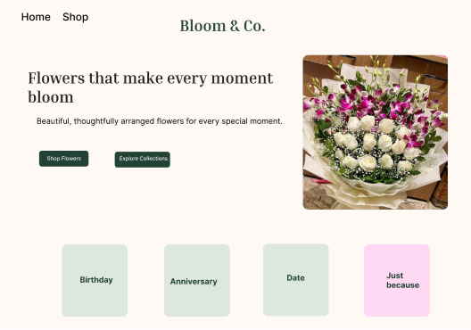
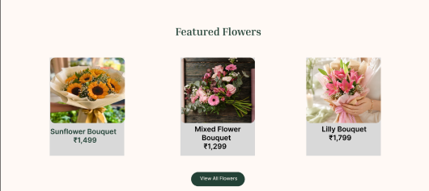
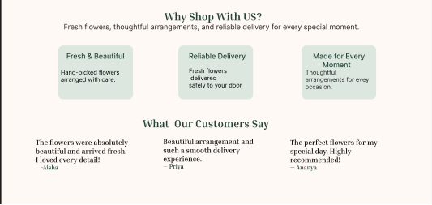
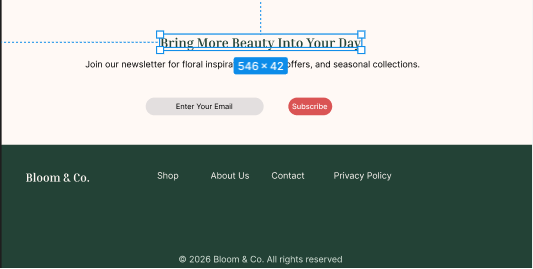

# Bloom & Co. – Florist eCommerce Landing Page

## Project Overview

Bloom & Co. is a modern florist eCommerce landing page designed for an online flower shop.

The design focuses on creating a clean, elegant, fresh, and welcoming experience while making it easy for customers to explore flowers and find arrangements for different occasions.

This project was created as a UI/UX design task based on a florist eCommerce design brief.

## Features

- Clean and minimal landing page design
- Hero section with a clear call-to-action
- Occasion-based flower categories
- Featured flower products with prices
- "Why Shop With Us?" section
- Customer testimonials
- Newsletter subscription section
- Simple and clean footer navigation

## Design Sections

### 1. Hero Section

The hero section introduces Bloom & Co. with the tagline:

> Flowers that make every moment bloom

It includes two call-to-action buttons:

- Shop Flowers
- Explore Collections

The section also highlights flower categories for different occasions:

- Birthday
- Anniversary
- Date
- Just Because

### 2. Featured Flowers

The featured products section displays selected flower arrangements with their names and prices.

Products shown include:

- Sunflower Bouquet – ₹1,499
- Mixed Flower Bouquet – ₹1,299
- Lilly Bouquet – ₹1,799

### 3. Why Shop With Us?

This section highlights the main benefits of shopping with Bloom & Co.:

- Fresh & Beautiful
- Reliable Delivery
- Made for Every Moment

It also includes customer testimonials to build trust with potential customers.

### 4. Newsletter & Footer

The newsletter section encourages visitors to subscribe for:

- Floral inspiration
- Special offers
- Seasonal collections

The footer contains navigation links such as:

- Shop
- About Us
- Contact
- Privacy Policy

## Design Approach

The design follows a:

- Minimalist
- Elegant
- Fresh
- Modern
- Colorful but balanced

visual style.

The layout focuses on clear visual hierarchy, consistent spacing, readable typography, and simple navigation.

## Screenshots

### Hero Section & Occasion Categories



### Featured Flowers



### Why Shop With Us & Testimonials



### Newsletter & Footer



## Tools Used

- Figma
- Git
- GitHub

## Project Structure

```text
Bloom-Co/
│
├── README.md
│
└── Images/
    ├── img1.png
    ├── img2.png
    ├── img3.png
    └── img4.png

##Live Design
https://www.figma.com/design/GiPDHTEk6hxL9TOnQWmx1F/Untitled?node-id=0-1&t=XPhRsZGswWP2ZaFg-1
